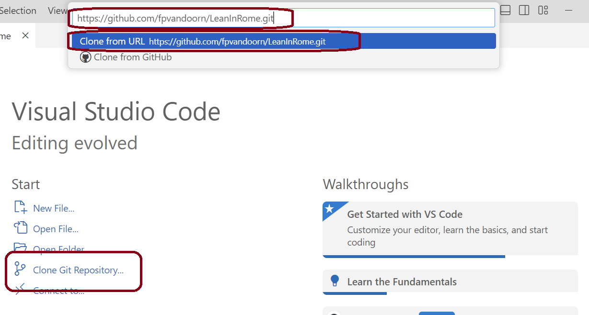
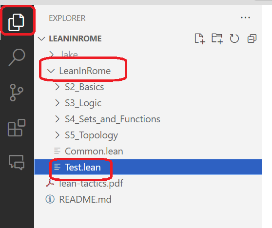
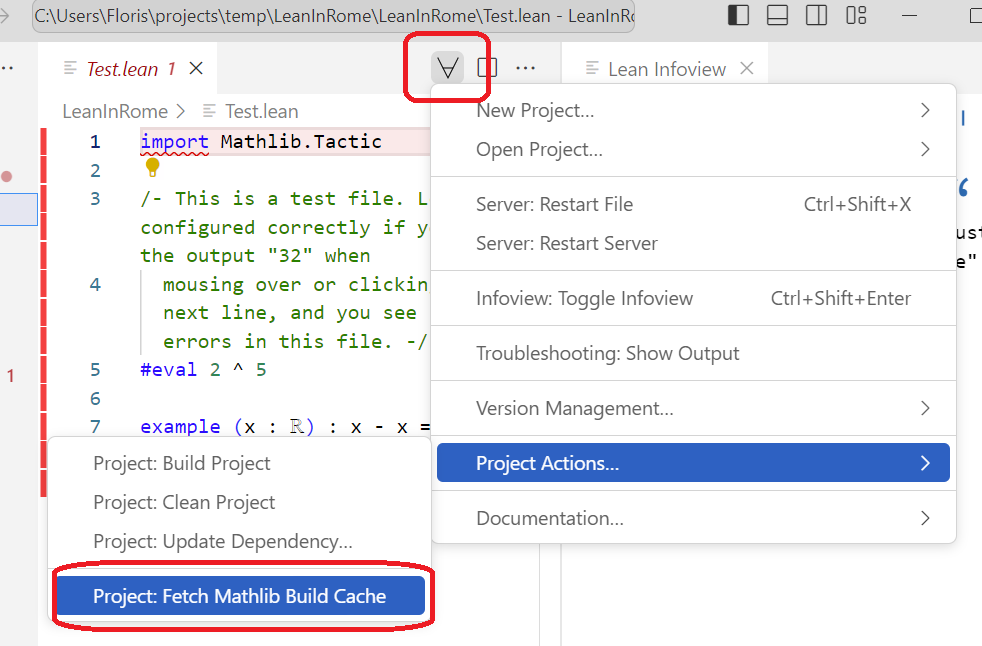

# Computer-verified proofs: 48 hours in Rome

24-26 January 2024

See the subfolder `LeanInRome` for the `.lean` files.

## Installation

Note: To get this repository, you will need to download Lean's mathematical library, which takes about 5 GB of storage space.

* You have to install Lean, and two supporting programs: Git and VSCode. Follow these [instructions](https://leanprover-community.github.io/get_started.html) to do this. You do not have to follow the last step (creating Lean projects). Instead, use either VSCode or a terminal to get this repository.

### Get the Repository using VSCode

* Open Visual Studio Code
* Press `Clone Git Repository` (if you don't see the welcome screen, you can press `ctrl+shift+P` (or `cmd+shift+P` on Mac, type `Git: Clone` and press `enter`)
* Type `https://github.com/fpvandoorn/LeanInRome.git` and press enter
* Choose a folder where you want to clone this repository (everything will be placed in a subfolder `LeanInRome`).

* Press `open` when asked if you want to open the cloned repository
* Open the file `LeanInRome/Test.lean` using the explorer button in the top-right. Do **not** press `Restart Lean` or `Rebuild Imports` when these pop-ups shows up before you do the next step.

* In the top-middle (or top-right) of the screen there is a Lean menu marked by `∀`.
  In it, choose `Project Actions... > Project: Fetch Mathlib Build Cache`.
  This downloads mathlib, and will take a bit of time.

* Once this is finished, press the `Rebuild Imports` button.

### Get the Repository using a terminal

* Open a terminal (I recommend `git bash` on Windows, which was installed as part of git in the first step).

* Use `cd` to navigate to a directory where you would like to create the `LeanInRome` folder.

* Run `git clone https://github.com/fpvandoorn/LeanInRome.git`.

* Run `cd LeanInRome`

* Run `lake exe cache get!`
  * This downloads mathlib, and will take a bit of time
  * On Windows, if you get an error that starts with `curl: (35) schannel: next InitializeSecurityContext failed` it is probably your antivirus program that doesn't like that we're downloading many files. The easiest solution is to temporarily disable your antivirus program.

* Run `lake build +LeanInRome.Common`
  * This should take less than 1 minute. If you get more than a few lines of output, then you're rebuilding Mathlib from scratch, which means that the previous step went wrong. You can quit the execution and ask for help.

* Launch VS Code, either through your application menu or by typing
  `code .` (note the dot!). (MacOS users need to take a one-off
  [extra step](https://code.visualstudio.com/docs/setup/mac#_launching-from-the-command-line)
   to be able to launch VS Code from the command line.)

* If you launched VS Code from a menu, on the main screen, or in the File menu,
  click "Open folder" (just "Open" on a Mac), and choose the folder
  `LeanInRome` (*not* one of its subfolders).

* Test that everything is working by opening `LeanInRome/Test.lean`.
  It is normal if it takes 10-40 seconds for Lean to start up.

### Update the repository

If you have already followed the steps above, and want to update the repository, open a terminal in your local copy of this repository (e.g. `cd LeanInRome`) and then run `git pull`. This gives you the new exercises.

### Error Lens extension

Optional: some users find it useful to download the `Error Lens` extension. This displays Lean messages directly in your source file.
To get it, in the left bar of VSCode, click on the `Extensions` button (4-th button), and search and install the extension `Error Lens`. It will start automatically.

## Altenative ways to use Lean

You can use Codespaces or Gitpod if you have trouble installing Lean locally. These work fine, but not as well as a locally installed copy of Lean.

### Using Codespaces

You can temporarily play with Lean using Github codespaces. This requires a Github account, and you can only use it for a limited amount of time each month. If you are signed in to Github, click here:

* Make sure the Machine type is `4-core`, and then press `Create codespace`
* After 1-2 minutes you see a VSCode window in your browser. However, it is still busily downloading mathlib in the background, so give it another few minutes (5 to be safe) and then open a `.lean` file to start.

### Using Gitpod

Gitpod is an alternative to codespaces that is slightly inconvenient, since it requires you to verify your phone number.

Click this button to get started:

This creates a virtual machine in the cloud,
and installs Lean and Mathlib.
It then presents you with a VS Code window, running in a virtual
copy of the repository.
You can update the repository by opening a terminal in the browser
and typing `git pull` followed by `lake exe cache get!` as above.

Gitpod gives you 50 free hours every month.
When you are done working, choose `Stop workspace` from the menu on the left.
The workspace should also stop automatically
30 minutes after the last interaction or 3 minutes after closing the tab.

To restart a previous workspace, go to [https://gitpod.io/workspaces/](https://gitpod.io/workspaces/).
